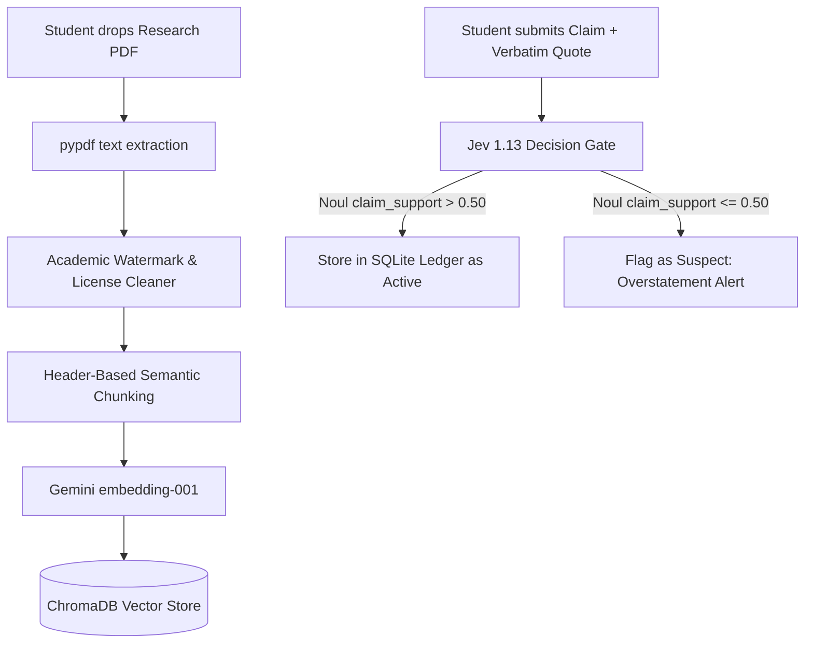
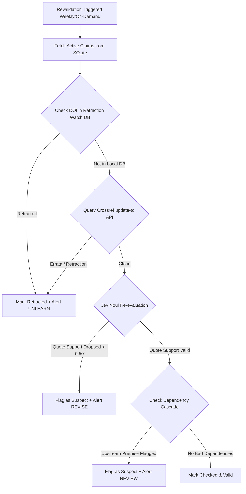

# 📚 Learning Ledger (AI)

<div align="center">

[](https://python.org)
[](https://fastapi.tiangolo.com)
[](https://aistudio.google.com)
[](https://openrouter.ai)
[](https://pypi.org/project/openharness-ai/)
[](https://ollama.com)
[](https://www.trychroma.com/)
[](https://opensource.org/licenses/MIT)

**An intelligent research memory system that remembers what you learn from scientific papers and tells you when it becomes wrong.**

[Live Dashboard](#-running-locally) • [Architecture](#-system-architecture) • [Flowchart](#-execution-flowchart) • [Tech Stack](#-technology-stack) • [Installation](#-local-installation-guide) • [Git Push Guide](#-how-to-push-changes-to-github)

</div>

---

## 📌 The Problem

When students, graduate researchers, and engineers read scientific literature, they synthesize key findings into mental models or notes:
* *"Model X reduces fine-tuning parameters by 10,000x with zero accuracy loss"*
* *"Molecule A inhibits Target B in vitro"*
* *"Algorithm Q scales quadratically rather than exponentially"*

However, **scientific knowledge is not permanent**:
1. **The Retraction & Replication Crisis**: Thousands of peer-reviewed papers are retracted, withdrawn, or flagged every year due to data manipulation, ethical lapses, or flawed methodologies.
2. **Post-Publication Errata & Amendments**: Authors routinely publish corrections and errata via Crossref that alter experimental parameters, margins of error, or code baselines.
3. **Semantic Drift & Human Overstatement**: When students summarize dense research, they often unintentionally exaggerate the authors' demonstrated claims (e.g., claiming a model works universally when it only worked on one synthetic benchmark).
4. **No "Unlearning" System**: Traditional tools like Notion, Obsidian, and Zotero store static notes. If a foundational paper cited six months ago in your literature review is retracted today, **no tool in your stack alerts you that your stored belief is now invalid**.

---

## 💡 The Solution: Learning Ledger

**Learning Ledger** is an active research companion that bridges the gap between reading scientific literature and maintaining long-term factual integrity:

* 📄 **Manuscript Ingestion with Semantic Chunking**: Ingests PDFs, strips publisher watermark banners (IEEE, Springer, Elsevier, ScienceDirect), and chunks text based on academic section headers.
* 🧠 **Grounded Literature Tutoring (RAG)**: Generates synthesized answers with verbatim citations and exact page numbers (`[LoRA.pdf, p.1]`), routed through local **IBM Granite** classifiers.
* ⚖️ **Typed Decision Gate (Jev 1.13)**: Mathematically validates whether your recorded belief is strictly supported by an exact source quote using probabilistic `Noul` ($0.0 - 1.0$) evaluation before saving it.
* 🛡️ **Continuous 4-Layer Revalidation Engine**:
  1. **Retraction Watch SQLite Index**: Instantly scans a local 300MB offline database of retracted DOIs.
  2. **Crossref Live API**: Checks the live `update-to` metadata array for published errata and notices.
  3. **Field-Velocity Confidence Decay**: Models how fast findings age per discipline ($\text{Decay} = \frac{1}{1 + \text{velocity} \times \text{age}}$).
  4. **Cascade Invalidation**: Recursively traces dependencies to flag any downstream claim that relied on a retracted premise.
* 🎓 **Student Scholar UI (UI/UX Pro Max)**: An academic interface featuring *Newsreader* serif typography, Swiss Modernism 2.0 grid layouts, one-click APA citation generation, and an active recall **Study Cards (Quiz Mode)** for exam and thesis preparation.

---

## 🎯 Core Use Cases

| Persona | Scenario | How Learning Ledger Solves It |
| :--- | :--- | :--- |
| **Graduate & PhD Students** | Writing literature reviews and thesis defense proposals. | Continuously validates that all cited foundational papers remain free of retractions, corrections, or methodology disputes. |
| **Independent AI Researchers** | Tracking state-of-the-art benchmark claims across arXiv preprints. | Models rapid field velocity decay in ML ($0.50/\text{year}$) and highlights claims whose supporting evidence needs re-verification. |
| **Undergraduate Students** | Preparing for exams and lab seminars. | Switches to **Study Cards Mode** to quiz themselves on claims, practicing active recall before revealing the verbatim quote and proof. |
| **Research Labs & PIs** | Auditing lab members' shared knowledge base and code hypotheses. | Traces dependency cascades (`depends_on`), showing which hypotheses collapse if an upstream finding is debunked. |

---

## 🏗️ System Architecture

```
                                  [ User Interface ]
                                   │              │
                   ┌───────────────┘              └───────────────┐
                   ▼                                              ▼
        Modern Web Dashboard                            Interactive CLI Shell
       (FastAPI + Vanilla CSS/JS)                            (src/main.py)
                   │                                              │
                   └──────────────────────┬───────────────────────┘
                                          │
 ┌────────────────────────────────────────┴────────────────────────────────────────┐
 │                                Core Pipelines                                   │
 ├───────────────────────────────┬───────────────────────────────┬─────────────────┤
 │ 📥 1. Ingestion & Retrieval   │ 🧠 2. Query & Reasoning       │ ⚖️ 3. Verification│
 │                               │                               │                 │
 │ • PDF parser (pypdf)          │ • Granite Query Classifier    │ • OpenHarness   │
 │ • Academic watermark cleaner  │   (Ollama / Hugging Face)     │   tool harness  │
 │ • Header-based semantic       │ • Vector Similarity Store     │ • Jev 1.13 Gate │
 │   chunking engine             │   (ChromaDB Collection)       │   (TypeSafe SDK │
 │ • License banner filters      │ • Grounded Synthesis Engine   │   via OpenRouter│
 │ • Gemini Embeddings           │   (Google Gemini 3.8 Flash)   │ • SQLite Ledger │
 └───────────────────────────────┴───────────────────────────────┴─────────────────┘
                                          │
 ┌────────────────────────────────────────┴────────────────────────────────────────┐
 │                  🛡️ Continuous Revalidation & Integrity Engine                 │
 ├─────────────────────────────────────────────────────────────────────────────────┤
 │ 1. Retraction Check: Local Retraction Watch SQLite (300MB) + Crossref Live API   │
 │ 2. Version Lifecycle: OpenAlex Work API for retractions & publication updates   │
 │ 3. Semantic Verification: Jev Noul (0.0 - 1.0) re-evaluates claim vs. quote    │
 │ 4. Confidence Decay: Field-velocity temporal decay + citation trajectory       │
 │ 5. Cascade Invalidation: Recursively flags claims dependent on bad premises    │
 └─────────────────────────────────────────────────────────────────────────────────┘
```

---

## 🔄 Execution Flowchart

### 1. Ingesting & Recording a Scientific Finding


### 2. Continuous Integrity & Retraction Revalidation


---

## 🛠️ Technology Stack

| Layer | Technology | Purpose | Key File |
| :--- | :--- | :--- | :--- |
| **Agent Harness** | **`openharness-ai`** | Typed Pydantic schemas for autonomous agent invocation | [`src/tools.py`](src/tools.py) |
| **Generative LLM** | **Google Gemini 3.8 Flash** | Fast, high-context literature synthesis and tutoring | [`src/llm.py`](src/llm.py) |
| **Dense Embeddings** | **Gemini `embedding-001`** | Vector representations for academic text chunks | [`src/embedder.py`](src/embedder.py) |
| **Decision Model** | **Jev 1.13 via TypeSafe SDK** | Mathematical probabilistic judgments (`Noul`, `Choice`, `Score`) | [`src/decisions.py`](src/decisions.py) |
| **Local Model Router**| **IBM Granite** (Ollama / HF) | Local query classification (conversational vs. paper query) | [`src/classifier.py`](src/classifier.py) |
| **Vector Database** | **ChromaDB** | Local cosine similarity vector storage & metadata search | [`src/retriever.py`](src/retriever.py) |
| **Integrity Database**| **SQLite & Crossref Data** | 300MB offline index of Retraction Watch records | [`src/integrity/retraction.py`](src/integrity/retraction.py) |
| **Academic APIs** | **Crossref, OpenAlex, Unpaywall**| Live errata checks, OA discovery, and citation counts | [`src/access.py`](src/access.py) |
| **Web Server** | **FastAPI & Uvicorn** | High-performance asynchronous REST backend | [`src/web.py`](src/web.py) |
| **Frontend UI** | **Vanilla CSS + Modern JS** | Swiss Modernism 2.0, Newsreader serif, Flashcard study deck | [`src/static/`](src/static/) |

---

## 🗺️ Implementation Plan & Roadmap

```
[Phase 1: Ingestion & Vector RAG] ──► Completed (pypdf, cleaner, ChromaDB, Gemini)
                  │
[Phase 2: Jev 1.13 Decision Gate] ──► Completed (Noul claim verification, TypeSafe SDK)
                  │
[Phase 3: Multi-Source Integrity] ──► Completed (Retraction Watch SQLite, Crossref API, Decay)
                  │
[Phase 4: Scholar Edition UI/UX]  ──► Completed (Study Cards Mode, APA Citation, Newsreader)
                  │
[Phase 5: Future Extensions]     ──► Planned (Zotero/Mendeley plugin, LaTeX auto-audit)
```

- [x] **Milestone 1**: Semantic PDF parser with watermark stripping (IEEE, Elsevier, Springer).
- [x] **Milestone 2**: ChromaDB dense retrieval pipeline with Gemini embeddings.
- [x] **Milestone 3**: Jev 1.13 decision gate verifying claim entailment against verbatim quotes.
- [x] **Milestone 4**: 300MB Retraction Watch dataset ingestion into indexed SQLite database.
- [x] **Milestone 5**: Crossref live `update-to` and OpenAlex publication version tracking.
- [x] **Milestone 6**: Field-velocity confidence decay calculations ($0.50/\text{yr}$ for ML down to $0.05/\text{yr}$ for Math).
- [x] **Milestone 7**: UI/UX Pro Max Scholar Edition: Flashcard revision mode, APA citation copying, and dark glassmorphic interface.
- [ ] **Milestone 8 (Upcoming)**: Bi-directional sync with Zotero and Mendeley libraries.
- [ ] **Milestone 9 (Upcoming)**: GitHub Action to continuously audit LaTeX `.bib` files during CI.

---

## 🚀 Local Installation Guide

### Prerequisites
* **Python 3.10+**
* [**uv**](https://docs.astral.sh/uv/) (strongly recommended for fast installs) or standard `pip`
* **Google Gemini API Key** ([Google AI Studio](https://aistudio.google.com/))
* **OpenRouter API Key** ([OpenRouter](https://openrouter.ai/keys)) for Jev Decision Gate

### Step 1: Clone the Repository
```bash
git clone https://github.com/danishjk2156/learning-ledger-AI.git
cd learning-ledger-AI
```

### Step 2: Install Dependencies

#### Option A: Using `uv` (Fastest)
```powershell
uv sync
```

#### Option B: Using standard `pip` & virtual environment
```powershell
python -m venv .venv
.venv\Scripts\activate
pip install -e .
```

### Step 3: Clone Retraction Watch Dataset
Learning Ledger includes a local SQLite index of retracted scientific literature for instant offline lookups:
```powershell
git clone https://gitlab.com/crossref/retraction-watch-data retraction-watch-data
```
*(On Windows, you can also run `.\setup.ps1` to automate this)*

### Step 4: Configure API Keys
Copy the example configuration:
```powershell
Copy-Item .env.example .env
```
Open `.env` and fill in your keys:
```env
# Required for Chat & Embeddings
GOOGLE_API_KEY=AIzaSy...

# Required for Jev 1.13 Decision Gate via OpenRouter
OPENROUTER_API_KEY=sk-or-v1-...

# Required for Unpaywall Open-Access Lookups (any valid email)
UNPAYWALL_EMAIL=researcher@example.com

# Optional: OpenAlex API key (improves rate limits)
OPENALEX_API_KEY=

# Optional: Local Ollama URL for IBM Granite Query Routing
OLLAMA_URL=http://localhost:11434
GRANITE_MODEL=granite3-dense:2b
```

### Step 5: Launch the Application

#### Option A: Modern Scholar Web Dashboard (Recommended)
```powershell
uv run ledger-ui
# or
uv run python -m src.web
```
Open **`http://localhost:8000`** in your browser to access the visual dashboard.

#### Option B: Interactive Terminal CLI
```powershell
uv run ledger
# or
uv run python -m src.main
```

---

## 📤 How to Push Changes to GitHub

To link your local repository and push your project to GitHub, execute the following commands in PowerShell or your terminal:

```powershell
# 1. Check current status and stage modified files
git status
git add .

# 2. Commit your changes
git commit -m "feat: complete learning ledger with UI/UX Pro Max Scholar Edition"

# 3. Add remote repository origin
git remote add origin https://github.com/danishjk2156/learning-ledger-AI.git

# 4. Rename current branch to main
git branch -M main

# 5. Push code to GitHub
git push -u origin main
```

> **Note:** If the remote repository already contains files (such as an initial README or license), you can run:
> ```powershell
> git pull origin main --rebase
> git push -u origin main
> ```

---

## 🧪 Running the Test Suite

Execute the automated test suite with `pytest`:
```powershell
uv run pytest -v
```
Tests cover:
* `tests/test_decisions.py`: Jev 1.13 decision gate operations.
* `tests/test_integrity.py`: Retraction Watch queries, Crossref updates, and decay formulas.
* `tests/test_ledger.py`: SQLite claim persistence, status transitions, and dependency tracking.
* `tests/test_llm.py`: Gemini client initialization and automatic model fallbacks.
* `tests/test_retriever.py`: Vector embeddings and ChromaDB collection querying.

---

## 📜 License

This project is licensed under the **MIT License** — see the [LICENSE](LICENSE) file for details. Built for scientific transparency, academic reproducibility, and open innovation.
